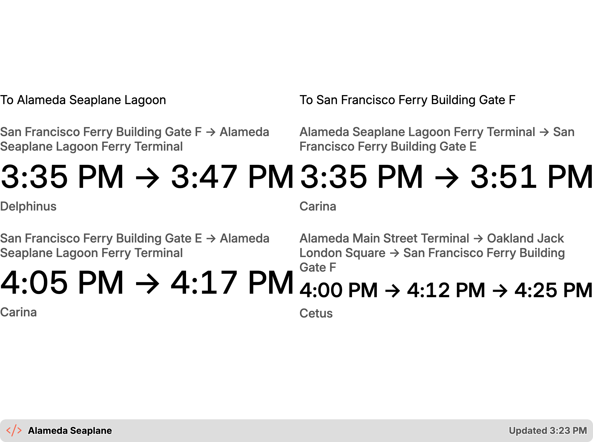
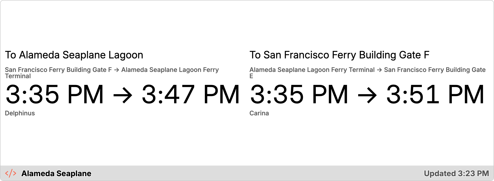
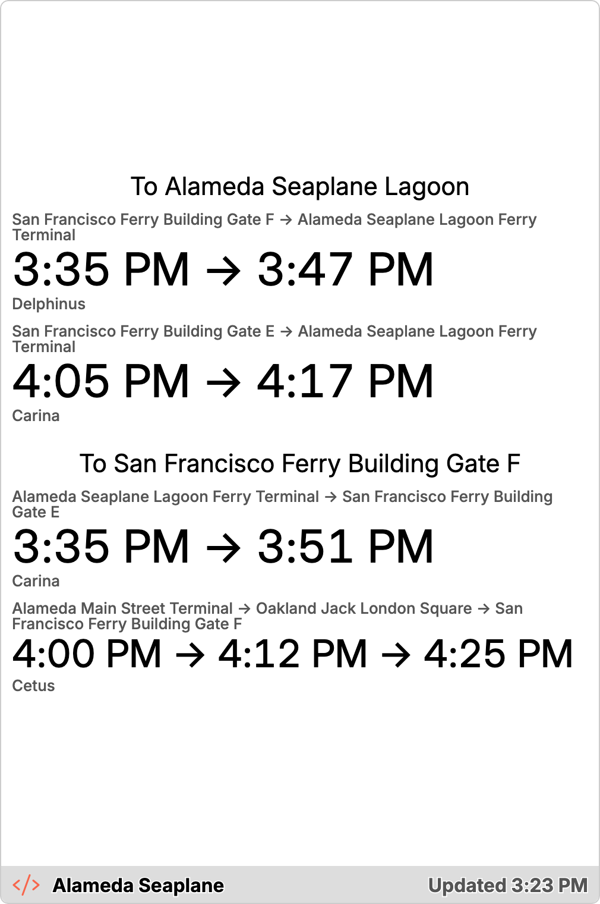
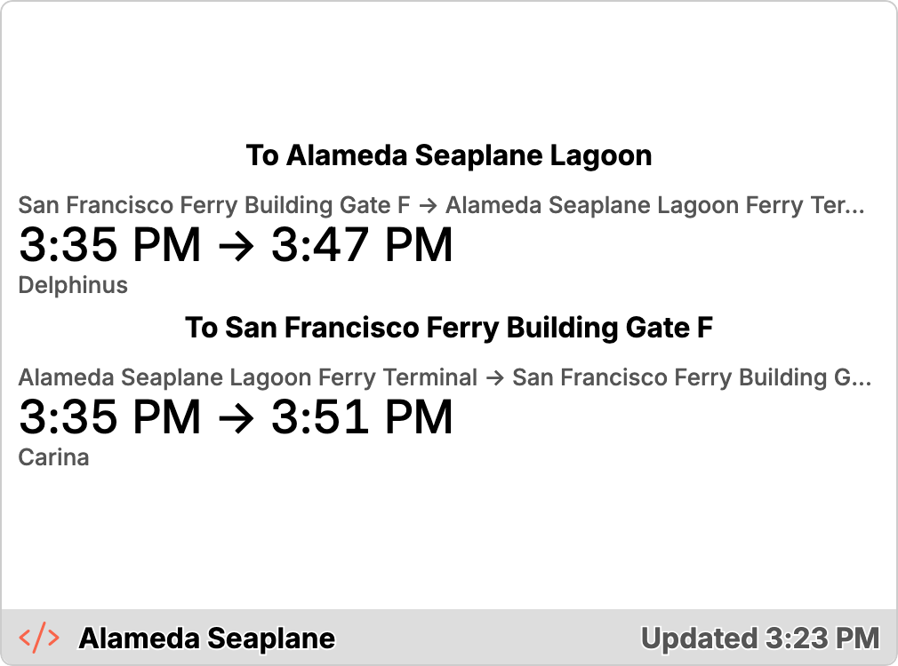

# Swiftly Routes — Transit arrivals on TRMNL

A [TRMNL](https://usetrmnl.com/) e-ink plugin that shows upcoming transit
arrivals for any Swiftly agency + route. Built for the SF Bay Ferry Alameda
Seaplane route (agency `sfbay-ferry`, route `19417` — the default smoketest
target), but the agency and route are TRMNL plugin inputs, so one install of
this recipe can be pointed at any route on any Swiftly agency you have an API
key for. Currently only optimized for TRMNL X resolutions.

## About Swiftly

[Swiftly](https://www.goswift.ly/) is a transit data platform that many
agencies (SF Bay Ferry among them) use to power real-time arrival
predictions, GTFS-RT feeds, and vehicle tracking. This plugin reads from
Swiftly's [Real-Time API](https://realtime-docs.goswift.ly/) — the same feed
agencies use to power their own rider-facing apps.

Access requires an API key, which is account-scoped to the agencies you're
authorized for. To request one, go to Swiftly's
[API license page](https://www.goswift.ly/api-license) and fill out the
linked Google form; Swiftly follows up by email with a key and further
details. There's no self-serve signup, so budget a few days for a human to
respond before you can install the plugin below.

## How it works

```
Swiftly API  →  TRMNL polling + serverless transform  →  Liquid templates
```

TRMNL's **Polling** strategy fetches one or more URLs and hands the raw JSON to a
**serverless transform** — a script TRMNL runs server-side (locally via
`trmnlp` in dev, or on TRMNL's hosted microVM daemon in production) — before
Liquid ever sees it. The Swiftly `gtfs-rt-trip-updates` feed is agency-wide
and large, so TRMNL polls it directly alongside agency info (for the
timezone) and verbose route info (for route directions and stop names).
`src/transform.js` (compiled from the type-safe `src/transform.ts`) consumes
those three already-fetched responses as `IDX_0`, `IDX_1`, and `IDX_2`,
buckets the feed's sailings by direction, and returns a small sculpted
payload the Liquid templates render directly. The transform performs no
network requests, keeping upstream latency outside its five-second runtime
limit:

```json
{
  "agency": "sfbay-ferry",
  "route_id": "19417",
  "route_name": "Alameda Seaplane",
  "updated_at": "7:11 PM",
  "sections": [
    {
      "title": "To San Francisco Ferry Building Gate F",
      "direction_id": "1",
      "trips": [
        {
          "vehicle": "Cetus",
          "stops": [
            { "name": "Alameda Seaplane Lagoon Ferry Terminal", "time": "7:11 PM", "mins": 12 },
            { "name": "San Francisco Ferry Building Gate F", "time": "7:27 PM", "mins": 28 }
          ]
        }
      ]
    }
  ]
}
```

`sections` has one entry per route **direction** — the templates iterate it
(``) and use `sec.title` as the column/row
heading. Each section's `trips` is a list of sailings, soonest-first by
origin departure. A trip is a `vehicle` plus an ordered `stops` chain (origin
→ any intermediate stops → destination); the template renders the
`stop.name` chain over the `stop.time` chain. The absolute `time` is shown
rather than the `mins` countdown — `mins` goes stale between TRMNL's slow
refreshes, the clock time does not. The trip lists are already sorted
soonest-first and capped with `limit:` in the template, so no sorting is
needed there. When `sections` is empty (the transform returns `error` for a
missing/invalid input, e.g. a bad route id or a rejected API key), the
templates render that message instead.

There's **no backend to deploy**: the plugin form fields (agency, route, and
your own Swiftly API key) are all any install needs. TRMNL runs the transform
on its own infrastructure.

## Repo layout

The plugin itself lives at the repo root (it's the one real deployable here):

| File | Shows |
|---|---|
| `src/full.liquid` | Full (800×480) layout — up to 4 trips per direction |
| `src/half_horizontal.liquid` | Half Horizontal (800×240) — next trip per direction |
| `src/half_vertical.liquid` | Half Vertical (400×480) — up to 2 trips per direction, stacked |
| `src/quadrant.liquid` | Quadrant (400×240) — next trip per direction, stacked |
| `src/settings.yml` | Plugin config: strategy, polling URLs, form fields |
| `src/transform.ts` | The type-safe source for `src/transform.js` — edit this, then `mise run build-transform` |
| `src/transform.js` | The serverless transform trmnlp/TRMNL execute. **Generated** from `transform.ts` — don't edit directly |
| `.trmnlp.yml` | Dev-server config + static preview data (not uploaded to TRMNL) |

Everything else is a subdirectory:

| Directory | What's in it |
|---|---|
| `scripts/` | Node tooling: `screenshots.mjs` (renders `docs/screenshots/*.png`), the transform build, and `swiftly.mjs` + `explore-routes.mjs`/`trip-updates.mjs`/`vehicle-positions.mjs` for poking the Swiftly API directly. `explore-routes.mjs` is how you find your agency's route id for step 2 below; `trip-updates.mjs` is handy for debugging the live feed. |
| [`docs/`](docs/) | Reference material (the Swiftly OpenAPI spec) and the screenshots below. |

This is a Node repo apart from `trmnlp` itself (a Ruby gem — see the
Toolchain note below); there is no separate build to run.

## Quick start

### 1. Bootstrap the toolchain

[`mise`](https://mise.jdx.dev/) is the version manager for the whole repo —
it provides Node and `trmnlp` (via mise's `gem:` backend, which needs Ruby).
All versions are pinned in [`mise.toml`](mise.toml); nothing needs to be on
the system PATH.

```sh
mise install        # run `mise trust` first if prompted
```

With mise activated in your shell, `node` / `npm` / `npx` / `trmnlp` resolve
automatically. If it is not activated, prefix every command below with
`mise exec --`.

`mise.toml` also defines the standard workflow as `[tasks]` — run any of
these with `mise run <name>` (mise loads your `.env` for every task, so a
`TRMNL_API_KEY` there is all `deploy` needs, no separate `trmnlp login`):

| Task | What it does |
|---|---|
| `mise run build-transform` | Compiles `src/transform.ts` to `src/transform.js` |
| `mise run typecheck-transform` | Typechecks `src/transform.ts` without emitting |
| `mise run screenshots` | Renders `docs/screenshots/*.png` (rebuilds the transform first) |
| `mise run lint` | `trmnlp lint` (rebuilds the transform first) |
| `mise run build` | `trmnlp build` — static HTML in `_build/` (rebuilds the transform first) |
| `mise run serve` | `trmnlp serve` — live-reloading preview (rebuilds the transform first) |
| `mise run deploy` | `trmnlp push` — ships `src/` to TRMNL (rebuilds the transform first) |

### 2. Find your agency and route id

You need a Swiftly API key (see [About Swiftly](#about-swiftly) above for how
to request one). Swiftly's response also tells you your `AGENCY_KEY`. Copy
`.env.example` to `.env` (mise loads it — see [`.env.example`](.env.example)),
fill in `SWIFTLY_API_KEY` and `AGENCY_KEY`, then list your agency's routes to
find the numeric id you want to poll:

```sh
npm install
node scripts/explore-routes.mjs                # lists every route with its id
node scripts/explore-routes.mjs --route 19417   # (optional) see that route's stops
```

`node scripts/trip-updates.mjs [--route ID] [--stops a,b,c]` and
`node scripts/vehicle-positions.mjs [--route ID]` are handy for debugging the
live feed once you know your route/stop ids.

### 3. Push the templates to TRMNL

Create a private plugin in TRMNL, copy its id into `src/settings.yml`, then:

```sh
npm install
mise run deploy   # builds the transform, then trmnlp push
```

`deploy` uses `TRMNL_API_KEY` from your `.env` if set, otherwise falls back to
a stored `trmnlp login` session (one time: `trmnlp login`).
`.github/workflows/trmnl.yml` does the same automatically on merge to `main`
once the (currently commented-out) `push` job is enabled and `TRMNL_API_KEY`
is set as a repo secret.

### 4. Configure the install

In the TRMNL dashboard, fill in the plugin form fields:

| Field | Example |
|---|---|
| Swiftly API Key | your key from step 2 |
| Agency | `sfbay-ferry` |
| Route | `19417` |

## Layouts

All four TRMNL sizes render from the same JSON payload — the templates differ
only in how many trips they show and whether directions are arranged in
columns or rows.

| Template | Size | Preview |
|---|---|---|
| `src/full.liquid` | 800×480 | [](docs/screenshots/full.png) |
| `src/half_horizontal.liquid` | 800×240 | [](docs/screenshots/half_horizontal.png) |
| `src/half_vertical.liquid` | 400×480 | [](docs/screenshots/half_vertical.png) |
| `src/quadrant.liquid` | 400×240 | [](docs/screenshots/quadrant.png) |

Previews are rendered from the sample payload in
[`.trmnlp.yml`](.trmnlp.yml) by `trmnlp build` and screenshotted with
headless Chromium. To regenerate after changing a template:

```sh
npm install                          # one time
npx playwright install chromium      # one time
mise run screenshots                 # writes docs/screenshots/*.png
```

## Local development

```sh
npm install
mise run serve   # builds the transform, then trmnlp serve at http://localhost:4567
```

Editing `src/transform.ts` needs a re-run of `mise run serve` (or
`mise run build-transform` on its own) before it takes effect — `trmnlp serve`
doesn't know about the `.ts` file, only `src/transform.js`. Saving
`transform.ts` does trigger trmnlp's own live-reload (it's inside the watched
`src/`), but that reload still uses whatever `transform.js` was last built, so
it can look like nothing changed until you rebuild.

- `mise run lint` — checks the plugin against TRMNL best practices
- `mise run build` — render all four layouts to static HTML in `_build/`
- `trmnlp pull` — overwrite `src/settings.yml` from the server (no transform
  step involved, so no `mise run` wrapper for this one)

### Preview data

By default `trmnlp serve`/`build` use the static sample payload in
`.trmnlp.yml`'s `variables:` block, so previews work offline — no Swiftly API
key needed.

To preview against **live** data instead, comment out the `variables:` block
in `.trmnlp.yml` and set `SWIFTLY_API_KEY` in a repo-root `.env` (mise loads
it — see [`.env.example`](.env.example)). The newline-separated `polling_url`
value hits all three Swiftly endpoints directly; `src/transform.js` (make
sure it's built — `mise run build-transform`) reshapes their responses.

One local-only quirk: `trmnlp` resolves `.trmnlp.yml`'s `{{ env.X }}`
templating for `polling_url`/`polling_headers`, but hands the transform the
*raw* templated string for `custom_fields_values`. This is harmless now that
the transform does not use the key for its own requests. Real installs
receive the plain value entered by the installer.

## Key facts

- The transform groups sailings by the route's **direction** (from Swiftly's
  verbose route info), not by stop, so multi-gate terminals (e.g. SF Ferry
  Building gates E/F/G) and multi-stop routes need no special handling.
- All Swiftly endpoints support `format=json`; this repo never parses
  protobuf.
- Swiftly auth is an `Authorization: <api-key>` header — the raw key, no
  scheme.
- There's no caching layer in front of Swiftly (the old self-hosted Worker
  had one, before this repo moved to TRMNL polling + serverless transforms) —
  each poll cycle costs three Swiftly calls per installed plugin instance. At
  the default 15-minute `refresh_interval` this is a light load; worth
  revisiting if Swiftly ever pushes back on request volume.

## Deploying

`mise run deploy` (builds the transform, then `trmnlp push`) uploads `src/` to
a TRMNL private plugin. It needs:
- an `id:` in `src/settings.yml` (the plugin's id — run `trmnlp pull` once to
  populate it, or copy it from the plugin's dashboard URL),
- authentication: a `TRMNL_API_KEY` in your `.env` (mise loads it — this is
  what lets `deploy` push straight from your machine with no extra step), or
  a stored `trmnlp login` session,
- `src/transform.js` built and up to date — `mise run deploy` always rebuilds
  it first, so this is automatic. It's what TRMNL actually executes, though
  `trmnlp push` uploads every file in `src/` unfiltered, so `transform.ts` and
  `tsconfig.json` tag along too (harmless — TRMNL only looks for
  `transform.{js,py,rb,php}`).

## CI

- [`.github/workflows/trmnl.yml`](.github/workflows/trmnl.yml) builds the
  transform and runs `trmnlp lint`/`build` on every PR, and (once its
  commented-out `push` job is enabled) `trmnlp push` on merge to `main`.
